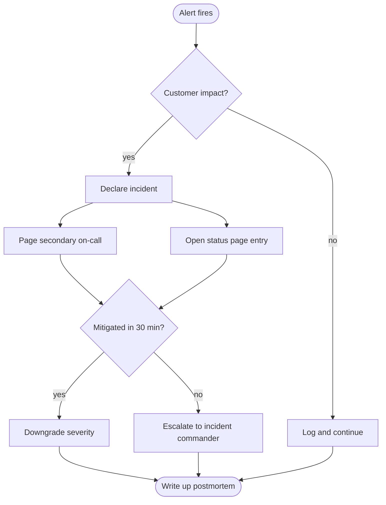

# Incident response

When an alert fires, the on-call engineer follows the path below. The diagram
is plain Mermaid in the Markdown source — Scribdown renders it in place, no
export step and no external diagram tool.

## Severity ladder

| Level | Response time | Who gets paged            |
| ----- | ------------- | ------------------------- |
| SEV-1 | 5 minutes     | On-call + commander       |
| SEV-2 | 15 minutes    | On-call                   |
| SEV-3 | Next workday  | Owning team's queue       |
