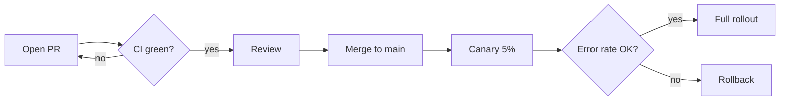

# Deployment Runbook

A living document for shipping the payments service. Everything here renders
straight from Markdown — no build step, no preview server, no copy-paste into
a wiki that goes stale a week later.

## Pre-flight checklist

- [x] Migration reviewed by a second engineer
- [x] Feature flag defaults to off
- [ ] Dashboards annotated with the release tag
- [ ] On-call notified in #payments-oncall

## Environments

| Environment | Region     | Replicas | Canary |
| ----------- | ---------- | -------: | :----: |
| staging     | eu-west-1  |        2 |   No   |
| production  | us-east-1  |       12 |  Yes   |
| production  | ap-south-1 |        6 |  Yes   |

> **Rollback budget**
> If the error rate stays above 0.5% for five minutes, roll back first and
> investigate afterwards. Nobody gets paged for rolling back too early.[^slo]

## Verifying a canary

```bash
kubectl -n payments rollout status deploy/payments-api --timeout=180s
curl -sf https://payments.internal/healthz | jq '.version'
```

## Release flow



## Escalation

Page the platform on-call only after the rollback completes. Attach the
release tag and the Grafana snapshot to the incident channel.

[^slo]: The 0.5% threshold is derived from the 99.5% availability SLO.
