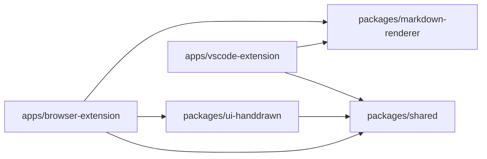
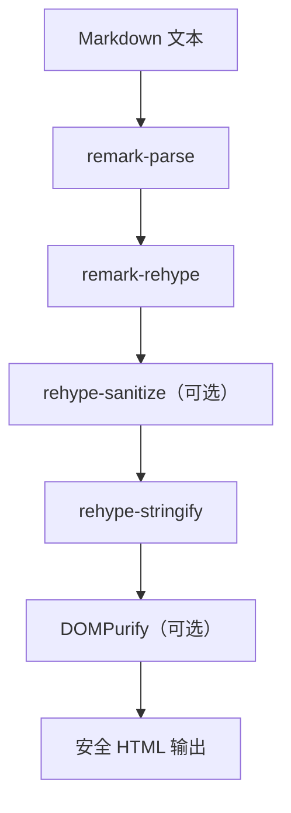

# 架构设计

## Monorepo 结构

```text
.
├── apps
│   ├── browser-extension   # 浏览器插件宿主
│   ├── vscode-extension    # VS Code 插件宿主
│   └── docs                # 文档站（本站）
├── packages
│   ├── markdown-renderer   # Markdown 渲染核心
│   ├── ui-handdrawn        # 手绘视觉组件库
│   └── shared              # 跨端常量与枚举
└── tools                   # 脚本与自动化工具
```

## 包依赖关系



## 渲染管线



## 分层职责

| 层级 | 路径 | 职责 |
| --- | --- | --- |
| 应用层 | `apps/*` | 宿主平台接入、UI 编排、壳层行为 |
| 领域能力层 | `packages/markdown-renderer` | Markdown 转换、安全策略、代码高亮 |
| 视觉组件层 | `packages/ui-handdrawn` | 手绘风格容器组件与样式 Token |
| 基础共享层 | `packages/shared` | 常量、枚举、跨端命名统一 |

## 关键约束

- 应用层优先依赖 `packages/*`，避免重复实现
- 常量和枚举必须复用 `@scribdown/shared`，避免硬编码分叉
- 平台差异仅在 `apps/*` 落地，渲染能力保持跨端一致
- 渲染安全默认可开关：`sanitizeHtml` + 自定义 `sanitize` 回调

## 工程化

| 工具 | 职责 |
| --- | --- |
| pnpm workspace | 工作区依赖管理 |
| Turborepo | 任务编排与构建缓存 |
| Changesets | 版本管理与发包流程 |
| Vite | 应用与共享包统一构建 |
| Vitest | 单元测试 |
| Playwright | 端到端测试 |
| ESLint + Prettier | 代码质量检查与格式化 |
