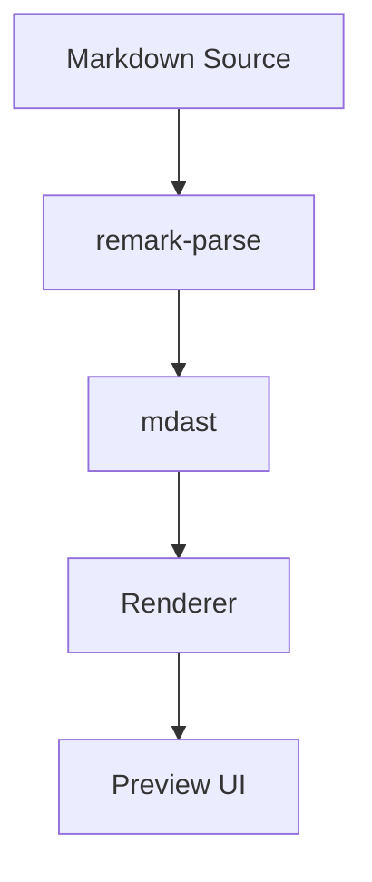
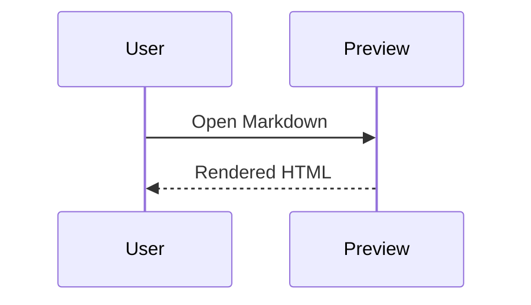

# Scribdown Markdown 完整语法预览

> Scribdown 是一个**手绘风格**的 Markdown 渲染器，只负责*展示*，不负责编辑。
>
> 这份文档覆盖 CommonMark、GFM 与常见扩展语法，用于视觉设计、渲染回归和安全策略验证。

[TOC]

## 目录说明

这是一个用于视觉设计的标准样例段落。它展示正文排版、链接样式、行内代码以及留白节奏。[查看文档](https://example.com "示例链接标题") 与 `inline code` 应同时出现，同时也包含 ~~删除线~~、==高亮==、<u>下划线</u>、H<sub>2</sub>O、E = mc<sup>2</sup>。\
这是通过显式换行符 `\` 产生的第二行，不是新段落。

这是另一个段落，用来验证普通换行会被合并为同一段落。
这一行在源码里换行，但没有硬换行标记。

## 标题层级

### h3 章节标题

#### h4 章节标题

##### h5 五级标题

###### h6 六级标题

Setext 一级标题
===============

Setext 二级标题
---------------

## 段落与文本样式

普通正文可以包含 *斜体*、_斜体_、**粗体**、__粗体__、***粗斜体***、___粗斜体___、`行内代码`、~~删除线~~、==标记高亮==、<mark>HTML 高亮</mark>、<small>小号文字</small>、<abbr title="HyperText Markup Language">HTML</abbr>。

Markdown 特殊字符可以被转义：\*不会变成斜体\*、\`不会变成代码\`、\[不会变成链接\]、\# 不会变成标题、1\. 不会变成有序列表。

HTML 实体也应正常显示：&copy; &reg; &trade; &amp; &lt; &gt; &quot; &#39;。

## 引用

> 一级引用中包含 **粗体**、`代码` 与 [链接](https://example.com)。
>
> > 二级嵌套引用。
>
> - 引用内列表项
> - 第二个列表项

## 列表示例

无序列表支持 `-`、`+`、`*` 三种标记：

- 支持 CommonMark 基础语法
- 支持引用、代码块、图片、链接、分隔线
  - 嵌套列表第二级
  - 再一项二级内容
    - 嵌套第三级

+ 加号列表项
+ 另一个加号列表项

* 星号列表项
* 另一个星号列表项

有序列表：

1. 浏览器插件（Chrome / Edge / Firefox）
2. VS Code Webview 预览容器
3. 其他宿主环境

从非 1 数字开始的有序列表：

3. 第三步
4. 第四步
5. 第五步

任务列表：

- [x] 支持 Markdown 渲染
- [x] 支持 Mermaid 图表
- [ ] 支持更多扩展语法策略
- [ ] 优化全屏查看体验

包含多段内容的列表项：

1. 第一项第一段。

   第一项第二段，前面保留缩进。

   ```txt
   列表项内部的围栏代码块
   ```

2. 第二项。

定义列表（常见扩展）：

Markdown
: 一种轻量级标记语言。

Scribdown
: 统一 Markdown 渲染体验的项目。

## 链接

行内链接：[Scribdown 示例](https://example.com/scribdown)

带标题的链接：[带标题链接](https://example.com/title "鼠标悬停标题")

自动链接：<https://example.com/autolink> 与 <hello@example.com>

裸 URL（GFM 自动链接）：https://example.com/bare-url

引用式链接：[查看文档][docs] 与 [设计规范][spec]

折叠引用链接：[docs][]

快捷引用链接：[spec]

页内锚点链接：[跳到表格](#表格示例)

## 图片示例

正常图片：


引用式图片：

![手绘风格预览][preview]

图片说明文：


_Figure 1. 手绘风格预览页，正文区使用暖纸色背景与克制的装饰纹理。_

加载失败的图片（`alt` 文本占位）：


## 代码示例

行内代码：`pnpm run build`、`const value = "inline";`。

缩进代码块：

    缩进四个空格形成代码块。
    第二行保持等宽文本。

普通围栏代码块：

```
没有语言标识的代码块。
```

TypeScript 代码块：

```ts
/**
 * 归一化标题文本。
 *
 * @param title 用户输入的标题文本。
 * @returns 去除首尾空白并压缩连续空格后的标题。
 */
export function normalizeTitle(title: string): string {
  // value 是归一化过程中的临时标题文本。
  const value: string = title.trim();

  // 关键步骤：压缩连续空白，保证标题显示稳定。
  return value.replace(/\s+/g, " ");
}
```

代码行高亮示例：

```ts {1,8-9}
/**
 * 渲染 Markdown 文本。
 *
 * @param source Markdown 源文本。
 * @returns 可用于预览的 HTML 字符串。
 */
export function renderMarkdown(source: string): string {
  // renderedHtml 是当前示例的渲染结果。
  const renderedHtml: string = source.trim();

  return renderedHtml;
}
```

Diff 代码块：

```diff
- 旧的文案
+ 新的文案
```

超长代码块（用于验证最大高度与纵向滚动，行号与代码同步滚动）：

```ts
/**
 * 任务调度器示例：演示超长代码块的纵向滚动表现。
 */
import { EventEmitter } from "node:events";

/**
 * 单个任务的元数据。
 */
interface TaskMetadata {
  /** 任务唯一标识。 */
  id: string;
  /** 任务展示名称。 */
  name: string;
  /** 任务优先级，数值越小越优先。 */
  priority: number;
  /** 任务创建时间戳（毫秒）。 */
  createdAt: number;
}

/**
 * 任务执行结果。
 */
interface TaskResult<TPayload> {
  /** 是否执行成功。 */
  ok: boolean;
  /** 成功时返回的负载。 */
  payload?: TPayload;
  /** 失败时的错误信息。 */
  error?: string;
}

/**
 * 简单的任务调度器：按优先级出队执行，支持失败重试。
 */
export class TaskScheduler<TPayload> extends EventEmitter {
  /** 待执行任务队列。 */
  private readonly pendingTasks: TaskMetadata[] = [];
  /** 单任务最大重试次数。 */
  private readonly maxRetryCount: number;
  /** 当前是否在执行中。 */
  private isRunning = false;

  /**
   * 创建调度器实例。
   * @param maxRetryCount 单任务最大重试次数，默认 3 次。
   */
  constructor(maxRetryCount = 3) {
    super();
    this.maxRetryCount = maxRetryCount;
  }

  /**
   * 入队一个任务并按优先级保持有序。
   * @param task 待入队任务元数据。
   */
  public enqueue(task: TaskMetadata): void {
    // 关键步骤：按优先级插入，避免每次出队都重新排序。
    const insertIndex = this.pendingTasks.findIndex((item) => item.priority > task.priority);

    if (insertIndex === -1) {
      this.pendingTasks.push(task);
    } else {
      this.pendingTasks.splice(insertIndex, 0, task);
    }

    this.emit("enqueued", task);
  }

  /**
   * 启动调度循环，直到队列清空。
   * @param runTask 单任务的实际执行函数。
   */
  public async run(runTask: (task: TaskMetadata) => Promise<TaskResult<TPayload>>): Promise<void> {
    if (this.isRunning) {
      return;
    }

    this.isRunning = true;

    try {
      while (this.pendingTasks.length > 0) {
        // 当前要执行的任务。
        const currentTask = this.pendingTasks.shift();

        if (!currentTask) {
          break;
        }

        // 剩余重试次数。
        let remainingRetries = this.maxRetryCount;
        // 当前任务最近一次执行结果。
        let lastResult: TaskResult<TPayload> | undefined;

        while (remainingRetries > 0) {
          lastResult = await runTask(currentTask);

          if (lastResult.ok) {
            this.emit("succeeded", currentTask, lastResult.payload);
            break;
          }

          remainingRetries -= 1;
        }

        if (!lastResult?.ok) {
          this.emit("failed", currentTask, lastResult?.error ?? "unknown error");
        }
      }
    } finally {
      this.isRunning = false;
      this.emit("drained");
    }
  }
}
```

## 表格示例

| 节点 | 状态 | 说明 |
| :--- | :--: | ---: |
| paragraph | ready | stable |
| code | ready | with shiki |
| table | default | horizontal scroll |
| escaped \| pipe | ready | 单元格内竖线 |

## 分隔线

---

***

___

## 数学公式

行内数学公式：$E = mc^2$。

块级数学公式：

$$
\int_{0}^{1} x^2 dx = \frac{1}{3}
$$

## 脚注

正文可以引用脚注。这里有一个脚注引用[^note]，还有一个长脚注引用[^long-note]。

[^note]: 这是一个短脚注。

[^long-note]: 这是一个包含多段内容的脚注。

    第二段需要缩进，便于验证脚注内部块级内容。

## Mermaid 示例

正常渲染：



序列图：



渲染失败（无效语法）：

```mermaid
invalid mermaid syntax @@@@
```

## ASCII 图

```text
+-------------+       +----------+       +------+
| Markdown    | ----> | Renderer | ----> | HTML |
+-------------+       +----------+       +------+
```

## HTML 示例

行内 HTML：

这是一段包含 <span>inline html</span>、<u>underline html</u>、<kbd>Cmd</kbd> + <kbd>K</kbd> 的正文，用于验证白名单标签的继承样式。

块级 HTML：

<div>
  <strong>Sanitized HTML block</strong>
  <p>这个块级 HTML 用于验证安全渲染链路下的排版继承效果。</p>
</div>

折叠详情：

<details>
  <summary>展开查看详情</summary>
  <p>这里是折叠内容，用于验证 details 与 summary 的默认样式。</p>
</details>

HTML 表格：

<table>
  <thead>
    <tr>
      <th>HTML 节点</th>
      <th>用途</th>
    </tr>
  </thead>
  <tbody>
    <tr>
      <td>table</td>
      <td>验证原生 HTML 表格样式</td>
    </tr>
  </tbody>
</table>

HTML 注释不会显示：

<!-- 这是一段 HTML 注释。 -->

被过滤 HTML（降级占位）：

```html
<script>alert("unsafe")</script>
```

## 视频示例

正常视频：

<video src="https://www.runoob.com/try/demo_source/movie.mp4" controls width="640" poster="https://inews.gtimg.com/newsapp_bt/0/13263837859/1000"></video>

加载失败的视频（仅显示控件占位与失败提示）：

<video src="https://example.invalid/broken-video-404.mp4" controls width="640"></video>

## 提示块与容器

普通引用式提示：

> **Note**
> 这是通过普通引用模拟的提示块。

VitePress 容器（常见扩展）：

::: tip
这是一个提示容器。
:::

::: warning
这是一个警告容器。
:::

::: details 点击展开
这是一个详情容器。
:::

## 前置信息块

```yaml
---
title: Markdown 完整语法预览
description: 用于验证 Markdown 渲染能力的样例文档
---
```

## 转义与边界场景

反斜杠转义集合：\\ \` \* \_ \{ \} \[ \] \( \) \# \+ \- \. \! \|。

连续空白与制表符：

```text
空格    会保留在代码块中
Tab	也会保留在代码块中
```

长单词用于验证换行能力：

supercalifragilisticexpialidocious-supercalifragilisticexpialidocious-supercalifragilisticexpialidocious

## 引用定义

[docs]: https://example.com/docs
[spec]: https://example.com/spec
[preview]: https://picsum.photos/id/1035/640/360
