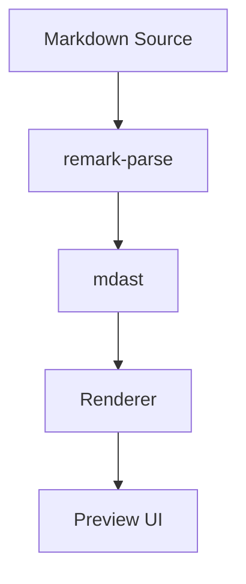

# 标准 Markdown 样例

用于 AI 在 Pencil 中填充统一内容，避免每次出图时内容结构漂移。覆盖主规范中已声明的主要块级节点、行内标记、扩展语法及关键失败态。

````markdown
# Scribdown 渲染预览

> Scribdown 是一个**手绘风格**的 Markdown 渲染器，只负责*展示*，不负责编辑。

这是一个用于视觉设计的标准样例段落。它展示正文排版、链接样式、行内代码以及留白节奏。[查看文档](https://example.com) 与 `inline code` 应同时出现，同时也包含 ~~delete~~、==highlight== 与 <u>underline</u> 三类行内标记。\
这是通过显式换行符 `\` 产生的第二行，不是新段落。

## 标题层级

### h3 章节标题

#### h4 章节标题

##### h5 五级标题

###### h6 六级标题

## 列表示例

无序列表（含嵌套）：

- 支持 CommonMark 基础语法
- 支持引用、代码块、图片、链接、分隔线
  - 嵌套列表第二级
  - 再一项二级内容
    - 嵌套第三级

有序列表：

1. 浏览器插件（Chrome / Edge / Firefox）
2. VS Code Webview 预览容器
3. 其他宿主环境

任务列表：

- [x] 支持 Markdown 渲染
- [x] 支持 `Mermaid` 图表
- [ ] 支持更多扩展语法策略
- [ ] 优化全屏查看体验

## 代码示例

```ts
export function renderMarkdown(source: string): string {
  return source.trim();
}
```

代码行高亮示例：

```ts {1,3-4}
export function normalizeTitle(title: string): string {
  const value = title.trim();
  return value.replace(/\s+/g, " ");
}
```

## 图片示例

正常图片：


图片说明文：


_Figure 1. 手绘风格预览页，正文区使用暖纸色背景与克制的装饰纹理。_

加载失败的图片（`alt` 文本占位）：


## Mermaid 示例

正常渲染：



渲染失败（无效语法）：

```mermaid
invalid mermaid syntax @@@@
```

## 视频示例

<video src="https://example.com/demo.mp4" controls></video>

## HTML 示例

行内 HTML：

这是一段包含 <span>inline html</span> 与 <u>underline html</u> 的正文，用于验证白名单标签的继承样式。

块级 HTML：

<div>
  <strong>Sanitized HTML block</strong>
  <p>这个块级 HTML 用于验证安全渲染链路下的排版继承效果。</p>
</div>

被过滤 HTML（降级占位）：

<script>alert("unsafe")</script>

## 引用式链接与图片

引用式链接：[查看文档][docs] 与 [设计规范][spec]

引用式图片：

![手绘风格预览][preview]

[docs]: https://example.com/docs
[spec]: https://example.com/spec
[preview]: https://example.com/preview.png

## 分隔线

---

## 表格示例

| Node | Status | Note |
| --- | --- | --- |
| paragraph | ready | stable |
| code | ready | with shiki |
| table | default | horizontal scroll |
````

## 样例使用规则

- 所有默认画板优先使用这份样例作为正文内容
- `Long Content` 画板在此基础上追加 2 倍正文长度、更长代码块和更复杂的 `Mermaid` 图表
- `State` 画板不使用该样例正文，只展示对应状态模块
- AI 在 Pencil 中绘制组件页时，可从该样例中拆出单个内容块作为组件实例
