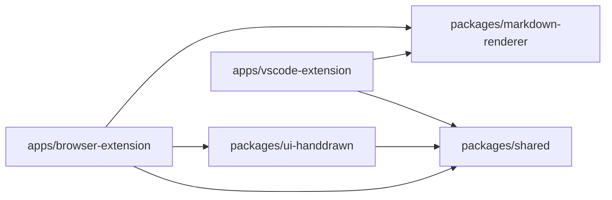
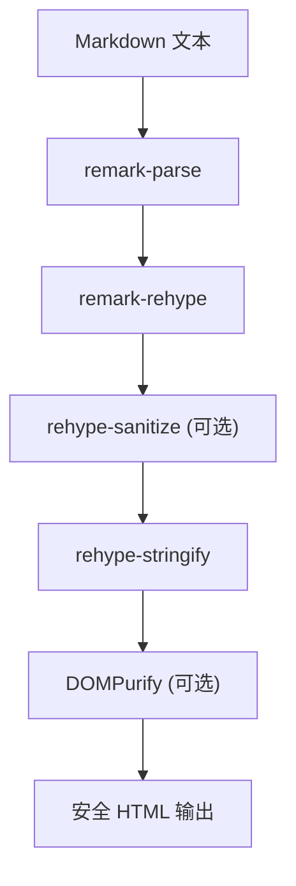

# 架构设计

## Monorepo 依赖关系

## 运行时渲染关系

## 架构分层

1. 应用层：`apps/*`，负责宿主平台接入与 UI 编排。
2. 领域能力层：`packages/markdown-renderer`，负责 Markdown 转换与安全策略。
3. 视觉组件层：`packages/ui-handdrawn`，负责统一手绘风格容器组件和样式。
4. 基础共享层：`packages/shared`，负责常量、枚举和跨端命名统一。

## 关键约束

- 应用层优先依赖 `packages/*`，避免重复实现。
- 常量和枚举必须复用 `@scribdown/shared`，避免硬编码分叉。
- 平台差异仅在 `apps/*` 落地，渲染能力保持跨端一致。
- 渲染安全默认可开关：`sanitizeHtml` + 自定义 `sanitize` 回调。
