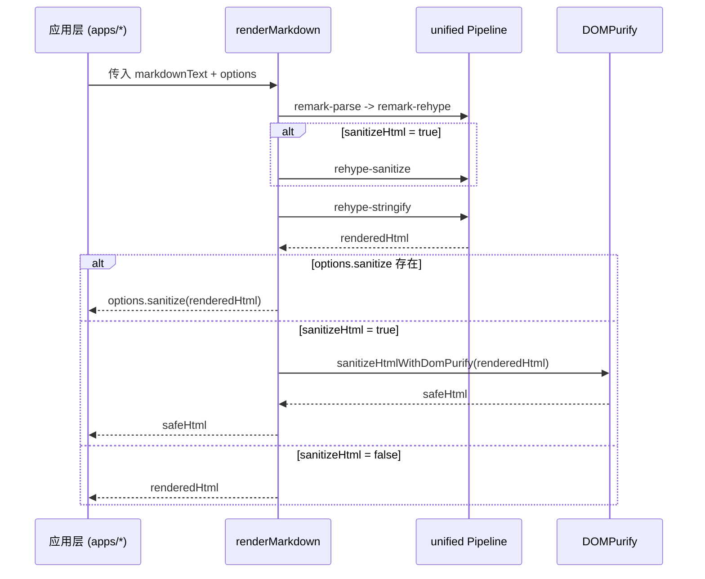

# 渲染流程与安全

## 流程图

## API 说明

### `renderMarkdown(markdownText, options?)`

- 输入：Markdown 字符串与渲染选项
- 输出：HTML 字符串（Promise）
- 选项：
  - `sanitizeHtml?: boolean` 是否启用清洗流程
  - `sanitize?: (unsafeHtml: string) => string` 自定义清洗函数

### `renderCodeToHtml(codeText, language)`

- 使用 Shiki 高亮代码
- 当前默认主题为 `github-light`
- 支持语言列表包含：`typescript`、`javascript`、`json`、`bash` 与调用方传入语言

### `sanitizeHtmlWithDomPurify(unsafeHtml)`

- 负责字符串级别安全清洗
- 适合在输出前做最终防护

## 安全策略建议

1. 默认在用户输入内容渲染时开启 `sanitizeHtml`。
2. 业务对标签白名单有额外要求时使用 `options.sanitize` 扩展。
3. Webview/浏览器宿主中展示 HTML 时统一走渲染层，不直接拼接不可信内容。
