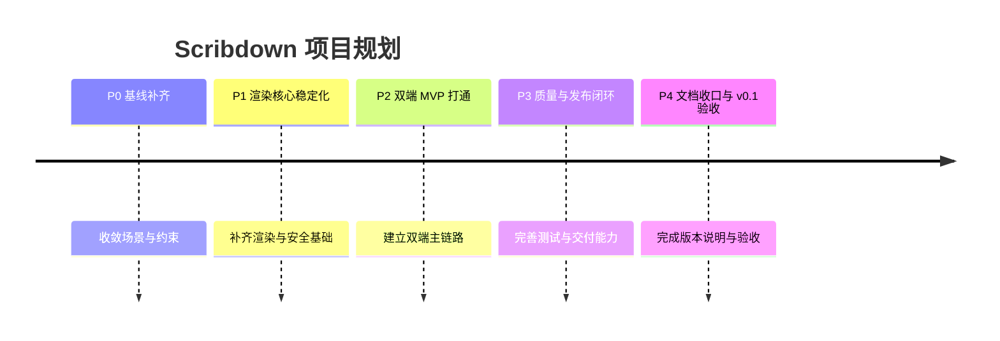

# 项目规划

## 一句话目标

Scribdown 目标是完成 `v0.1`，形成一个可演示、可测试、可持续迭代的双端 Markdown 预览产品。

## 版本目标

`v0.1` 只解决三件事：

- 浏览器插件有一个清晰、稳定的核心使用场景。
- VS Code 插件能围绕当前文档提供可用预览。
- 渲染核心、测试基线和文档说明能支撑后续迭代。

本阶段不追求的事项：

- 多语言国际化
- 第三方云同步
- 在线协作编辑
- 大规模主题市场

## 当前判断

### 已有基础

- Monorepo、构建、类型检查和测试命令已经接通。
- `packages/markdown-renderer` 已具备基础渲染、HTML 清洗和代码高亮能力。
- 浏览器插件已经能展示基础预览页面。
- VS Code 插件已经有命令入口和 Webview 容器。

### 当前问题

| 问题 | 现状 |
| --- | --- |
| 产品场景不清晰 | 两端都更接近演示态，还没有稳定的核心用户路径 |
| 渲染能力不够稳 | Markdown 支持范围、测试覆盖和安全回归样例都不完整 |
| 渲染节点定义不完整 | 关键 Markdown 节点的支持范围、渲染规则和双端一致性标准还没有收敛 |
| VS Code 体验不完整 | 还没有稳定的文档读取、刷新和预览联动 |
| 浏览器插件定位不清 | 还没有收敛到单一主场景 |
| 手绘风格基线未定稿 | `ui-handdrawn` 已有基础组件，但视觉风格、主题变量和组件边界还没有定稿 |
| 质量门槛未落地 | `lint` 仍是占位脚本，自动化回归能力不足 |
| 发布定位未收敛 | 当前更像版本管理骨架，不是完整发布流程 |
| 文档口径偏目标态 | 部分页面对 `lint`、`release`、渲染安全语义的描述早于实际实现 |
| 演示示例不够完整 | 当前缺少覆盖核心节点和双端场景的稳定演示样例 |

## 规划原则

- 先收敛场景，再扩功能。
- 先稳定共享渲染核心，再完善双端体验。
- 先把文档写成现状，再写目标，不把未完成事项写成既成事实。
- `v0.1` 优先解决可用性和可维护性，不追求功能铺满。

## 里程碑总览

## 阶段安排

| 阶段 | 顺序 | 目标 | 关键结果 |
| --- | --- | --- | --- |
| P0 基线补齐 | 第一阶段 | 收敛场景、统一约束、修正文档现状口径 | MVP 场景明确，公共常量和渲染参数收口，Wiki 与实现一致 |
| P1 渲染核心稳定化 | 第二阶段 | 提升渲染能力稳定性和安全确定性 | Markdown 支持矩阵、回归用例、API 语义和测试补齐 |
| P2 双端 MVP 打通 | 第三阶段 | 形成双端可演示主链路 | 浏览器插件和 VS Code 插件都能围绕真实文档完成预览 |
| P3 质量与发布闭环 | 第四阶段 | 形成最低可维护和可交付能力 | lint、测试、E2E、版本管理和发布检查项成体系 |
| P4 文档收口与验收 | 第五阶段 | 完成 `v0.1` 验收和对外说明 | README、Wiki、演示路径、已知限制同步完成 |

## P0 基线补齐

### 目标

- 明确浏览器插件和 VS Code 插件的首个核心场景。
- 收敛共享常量、配置项和模块边界。
- 修正文档中的目标态描述，让现状、规划、目标分开。

### 关键事项

- 输出双端 MVP 场景定义。
- 补齐 `packages/shared` 中的平台、主题和命令约束。
- 梳理渲染参数对象，统一默认值和扩展入口。
- 修正 `lint`、`release`、渲染安全语义等文档描述。

### 验收标准

- 每个应用的首版用户路径能在一页文档内说清。
- 不再新增跨模块硬编码常量。
- 渲染入口参数有统一类型和默认策略。
- Wiki 中关于 `lint`、`release`、渲染安全语义的描述与当前实现一致。

## P1 渲染核心稳定化

### 目标

- 把 `packages/markdown-renderer` 从“可用”提升到“可依赖”。
- 建立围绕安全、兼容性和扩展性的测试基础。

### 关键事项

- 补齐常见 Markdown 元素渲染覆盖。
- 明确核心 Markdown 节点清单、节点渲染规则和双端一致性约束。
- 梳理 HTML 清洗白名单和危险输入回归用例。
- 为代码高亮、DOMPurify 清洗和 sanitize 开关补充测试。
- 明确 `options.sanitize` 等安全相关 API 的生效边界，并通过文档和测试固化。

### 验收标准

- 核心渲染能力具备稳定单元测试覆盖。
- 核心 Markdown 节点的支持范围和渲染规则有明确说明。
- 安全相关输入有明确回归样例。
- 共享渲染包可以被两个应用以同一方式接入。

## P2 双端 MVP 打通

### 目标

- 让浏览器插件和 VS Code 插件都具备真实可演示的核心价值。

### 关键事项

浏览器插件：

- 收敛到单一主场景，优先考虑“插件弹窗 Markdown 输入即预览”。
- 增加基础状态管理、错误提示和空态展示。
- 统一接入手绘风格容器与主题变量。
- 收敛手绘风格的基础视觉规范，明确组件边界和可复用样式约束。

VS Code 插件：

- 支持读取当前活动文档内容并渲染到 Webview。
- 支持文档变更后的预览刷新。
- 明确命令入口和面板生命周期管理。

共享层：

- 提取双端共用的数据结构、事件名和配置常量。

### 验收标准

- 浏览器插件和 VS Code 插件都能围绕真实 Markdown 文档完成一次完整预览。
- 用户操作链路不依赖手工改代码或固定 mock。
- 双端展示结果在主要 Markdown 场景下基本一致。
- `ui-handdrawn` 的基础视觉风格和通用组件边界达成稳定共识。

## P3 质量与发布闭环

### 目标

- 让项目具备稳定回归和最小交付能力。

### 关键事项

- 补齐单元测试缺口，优先覆盖共享常量、渲染输出和宿主集成逻辑。
- 新增至少 1 条浏览器插件 E2E 和 1 条 VS Code 关键路径验证。
- 收敛 lint 占位脚本，替换为实际可执行规则。
- 梳理 Changesets 使用规范、版本节奏和发布检查项。
- 根据包的公开策略，决定继续保留“版本管理骨架”定位，还是进入真实发布流程。

### 验收标准

- `lint`、`typecheck`、`test`、`e2e` 形成明确质量门槛。
- 发布前检查项可执行，不依赖口头约定。
- 任一关键功能回归都能被至少一种自动化检查覆盖。

## P4 文档收口与 v0.1 验收

### 目标

- 以 `v0.1` 为交付对象完成验收、演示和文档收口。

### 关键事项

- README、Wiki、快速开始、发布说明与实际能力对齐。
- 输出一份覆盖双端核心场景的演示用例清单。
- 补齐覆盖核心 Markdown 节点和典型交互路径的演示示例。
- 整理已知问题、后续路线和 `v0.2` 候选项。

### 验收标准

- 新成员可依据文档独立完成安装、运行和基础验证。
- 演示路径清晰，版本边界明确。
- 演示示例能够覆盖核心节点、关键场景和双端主链路。
- 已知限制已被记录，未解决事项没有隐性承诺。

## 优先级

| 优先级 | 事项 | 原因 |
| --- | --- | --- |
| P0 | 渲染核心稳定性 | 双端共用基础，不先稳住会持续返工 |
| P0 | VS Code 文档实时预览 | 这是编辑器插件最直接的用户价值 |
| P0 | 浏览器插件场景收敛 | 场景不清晰，需求会持续发散 |
| P1 | 自动化测试补齐 | 没有回归保护，渲染和安全改动风险过高 |
| P1 | lint 与发布流程落地 | 当前已有骨架，但约束力不足 |
| P2 | 高级主题和扩展市场 | 有价值，但不属于 `v0.1` 核心交付 |

## 风险与应对

| 风险 | 影响 | 应对策略 |
| --- | --- | --- |
| 浏览器插件场景持续摇摆 | 需求蔓延，交付时间不可控 | 在 P0 固定单一主场景，其他需求延后 |
| VS Code Webview 与编辑器状态同步复杂 | MVP 延期 | 先只解决当前活动文档预览，不做多标签复杂管理 |
| Markdown 安全策略调整频繁 | 渲染结果不稳定 | 用回归样例锁定危险输入与允许范围 |
| 缺少自动化测试 | 修改后容易引入隐性回归 | P1、P3 分阶段补齐最关键路径 |
| UI 手绘风格投入过深 | 挤压核心能力开发时间 | `v0.1` 只保留基础品牌风格，不做重设计扩张 |
| 文档与实现阶段不一致 | 影响协作判断，导致错误预期和返工 | 在 P0 修正文档现状描述，后续文档变更必须同步实际实现进度 |

## v0.1 验收清单

- 浏览器插件可在弹窗内完成 Markdown 输入与预览。
- VS Code 插件可对当前文档进行打开预览和内容刷新。
- `packages/markdown-renderer` 具备核心渲染与安全测试。
- `packages/shared` 中的常量、枚举、命令和主题命名统一。
- Wiki、README、开发命令和发布说明与现状一致。
- 关键路径自动化检查可运行。

## v0.2 候选方向

- 浏览器页面内嵌预览或侧边栏预览。
- VS Code 编辑器联动增强，例如滚动同步、点击定位。
- 更多主题样式和可配置手绘参数。
- 渲染插件扩展机制。
- 剪藏、导出或内容资产管理能力。
